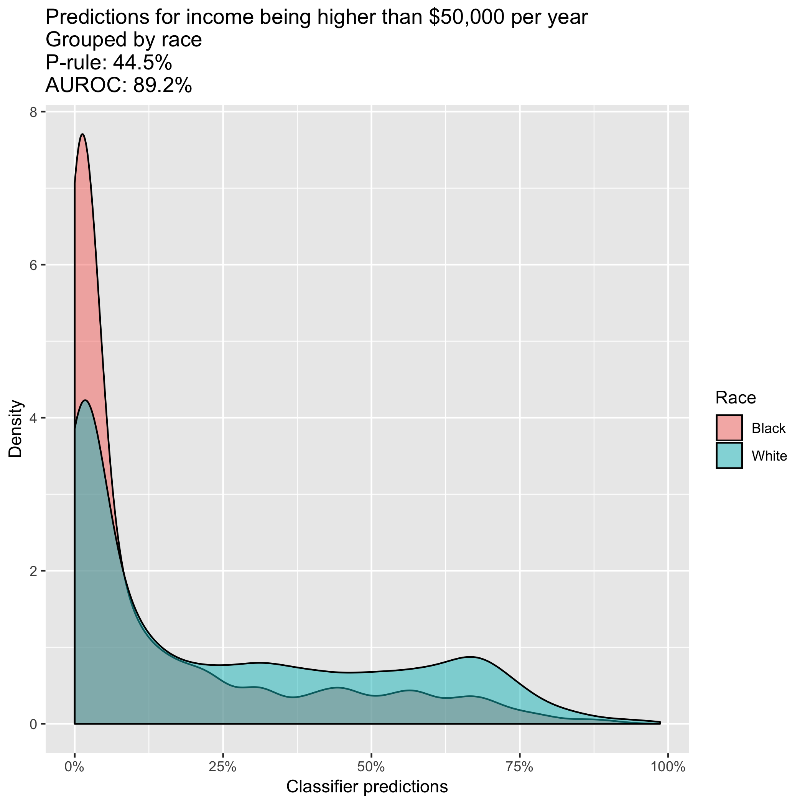
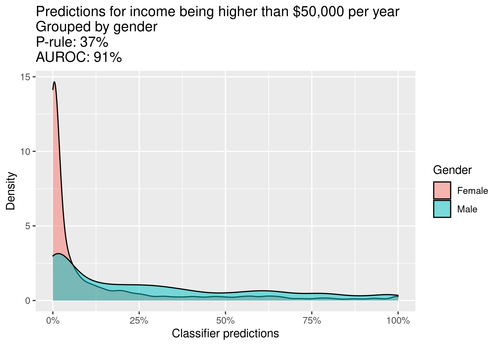
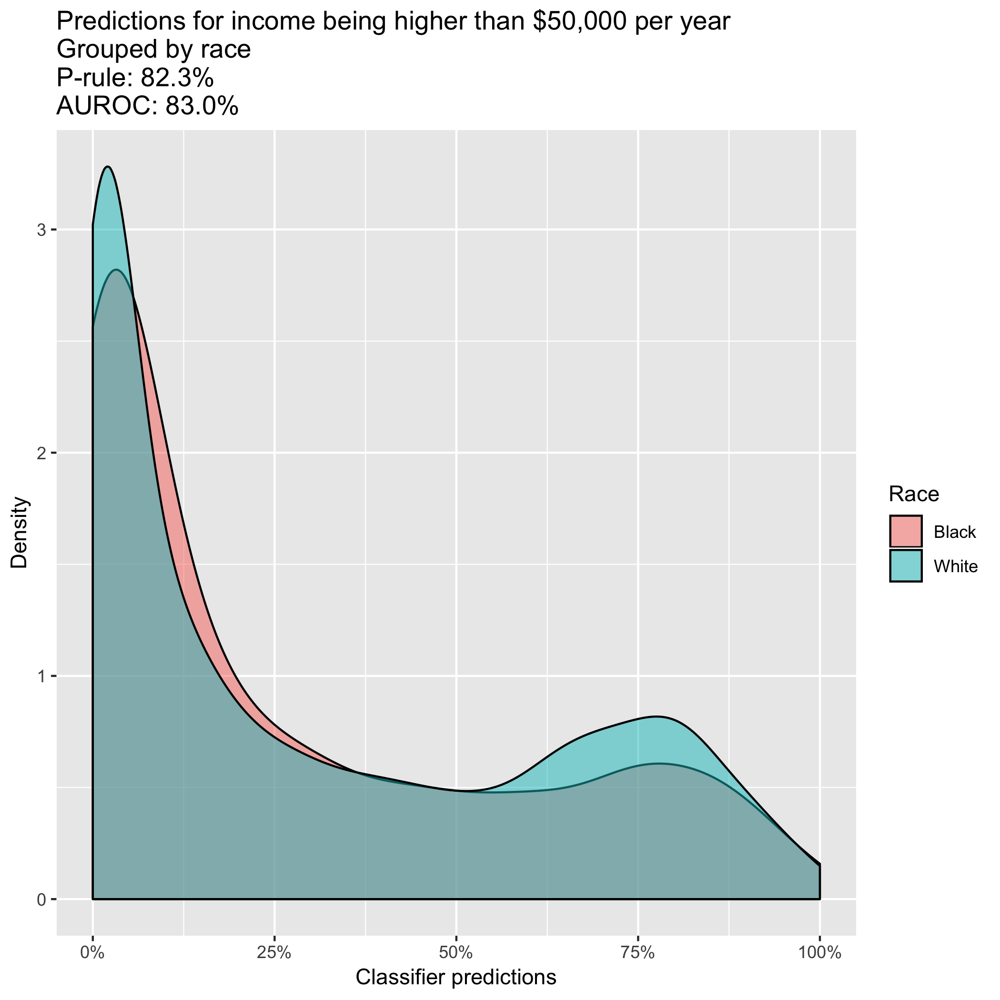
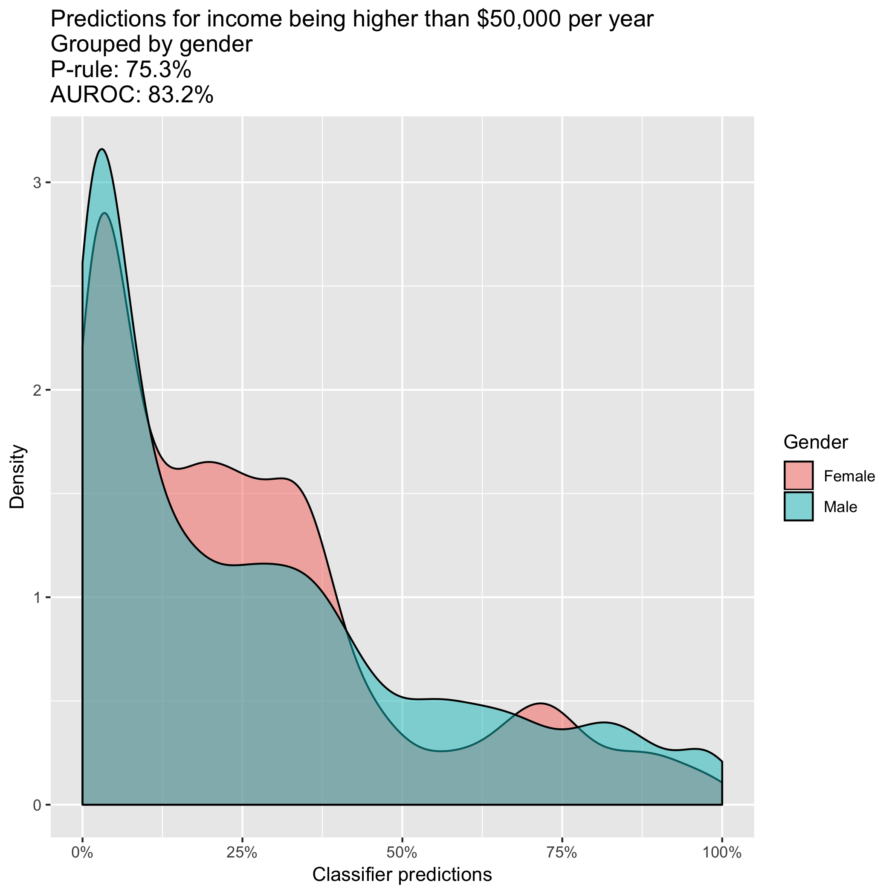

```{r setup, include=FALSE}
knitr::opts_chunk$set(echo = TRUE)
```

## Disclaimer

This work is not necessarily a representation of any past or current employer of mine.

## Introduction

- Ensuring fairness in machine learning is a key aspect especially in the financial services domain.
    - Think of a mortgage underwriting machine learning pipeline that perhaps might be sensitive to attributes such as gender and race without explicitly being trained on such features. 
    - This can potentially cause a hidden cost of capital charge from an operational risk perspective if customers are not treated fairly.
    - Clearly a machine learning pipeline that makes unfair decisions given the same feature vector across multiple groups such as gender and race is unethical.

- To overcome this potential issue we discuss a method published in the 31st conference on Neural Information Processing Systems, i.e., NeurIPS 2017. 
    - The title of that paper: "Learning to Pivot with Adversarial Networks". 

- I first came across the aforementioned NeurIPS paper in this blogpost.
    - <https://blog.godatadriven.com/fairness-in-ml>

- My lecture will discuss the aforementioned paper and Generative Adversarial Networks (GAN) in detail. It will also provide a R version of the code associated in the aforementioned blogpost. 

## Income Prediction

- We use the "Census Income" dataset to predict whether a person's income is greater than $50,000 per year. The link to the dataset is here.
    - <https://archive.ics.uci.edu/ml/datasets/Adult>

- The features used are denoted as below.
    - $x \sim P_{X}(x)$

- The sensitive attribute(s) are denoted as below.
    - $z \sim P_{Z}(z)$

- The target variable is denoted as below.
    - $y \sim P_{Y}(y)$

## Classifier and Adversarial Model

- The classifier is a deep learner denoted as below.
    - $C(x | \theta_{C}): x \rightarrow y$

- Note that we are not explicitly training the model on the sensitive attributes. However it is entirely possible that there might be some hidden bias within our features that perhaps act as proxies for the sensitive attributes.

- The sensitive attributes for this exercise are race and gender. These are binary variables.

- For each of these sensitive attributes we want to ensure the following holds.
    - $P(C(x | \theta_{C})|z = 1) = P(C(x | \theta_{C})|z = 0) \text{    } \forall x \sim P_{X}(x)$
    
- We introduce the concept of an adversarial deep learner model which takes in the predictions of the classifier in order to predict the sensitive attributes as below.
    - $R(C(x | \theta_{C}) | \theta_{R}): C(x | \theta_{C}) \rightarrow z$

- In an ideal scenario the classifier will perform at its optimal level while simultaneously the adversarial model will be completely unable to predict sensitive attributes given the predictions from the optimal classifier. Therefore, $C(x | \theta_{C}^\ast)$ and $Z$ will be independent random variables.

- We now introduce the GAN model in which the generator plays the role of the classifier and the discriminator plays the role of the adversarial model.

## Generative Adversarial Networks

- The purpose of deep learning is to learn a representation of high dimensional and noisy data using a sequence of differentiable functions, i.e., geometric transformations, that can perhaps be used for supervised learning tasks among others. 

- It has had great success in discriminative models while generative models have fared worse due to the limitations of explicit maximum likelihood estimation (MLE). 

- Adversarial learning as presented in the GAN model aims to overcome these problems by using implicit MLE. 

## Generative Adversarial Networks

- There are 2 main components to a GAN, the generator and the discriminator, that play an adversarial game against each other. 

- In doing so the generator learns how to create realistic synthetic samples from noise, i.e., the latent space $z$, while the discriminator learns how to distinguish between a real sample and a synthetic sample. 

- The representation learnt by the discriminator can later on be used for other supervised learning tasks, i.e., automatic feature engineering or representation learning. 

## Generative Adversarial Networks

### Generator

- Assume that we have a prior belief on where the latent space $z$ lies: $p(z)$. 

- Given a draw from this latent space the generator $G$, a deep learner parameterized by $\theta_{G}$, outputs a synthetic sample.
    - $G(z|\theta_{G}): z \rightarrow x_{synthetic}$

## Generative Adversarial Networks

### Discriminator

- The discriminator $D$ is another deep learner parameterized by $\theta_{D}$ and it aims to classify if a sample is real or synthetic, i.e., if a sample is from the real data distribution: $p_{\text{data}}(x)$

- Or the synthetic data distribution: $p_{G}(x)$

- Let us denote the discriminator $D$ as follows.
    - $D(x|\theta_{D}): x \rightarrow [0, 1]$

- Here we assume that the positive examples are from the real data distribution while the negative examples are from the synthetic data distribution.

## Generative Adversarial Networks

### Game

- A GAN simultaneously trains the discriminator to correctly classify real and synthetic examples while training the generator to create synthetic examples such that the discriminator incorrectly classifies real and synthetic examples. 

- This 2 player minimax game has the following objective function.
\tiny
$$
\min_{G(z|\theta_{G})} \max_{D(x|\theta_{D})} V(D(x|\theta_{D}), G(z|\theta_{G})) = \mathbb{E}_{x \sim p_{\text{data}}(x)} \log{D(x|\theta_{D})} + \mathbb{E}_{z \sim p(z)} \log{(1 - D(G(z|\theta_{G})|\theta_{D}))}
$$

## Generative Adversarial Networks

### Game

- Please note that the above expression is basically the objective function of the discriminator.
\tiny
$$
\mathbb{E}_{x \sim p_{\text{data}}(x)} \log{D(x|\theta_{D})} + \mathbb{E}_{x \sim p_{G}(x)} \log{(1 - D(x|\theta_{D}))}
$$
\normalsize

- It is clear from how the game has been set up that we are trying to obtain a solution $\theta_{D}$ for $D$ such that it maximizes $V(D, G)$ while simultaneously we are trying to obtain a solution $\theta_{G}$ for $G$ such that it minimizes $V(D, G)$.

## Generative Adversarial Networks

### Game

- We do not simultaneously train $D$ and $G$. We train them alternately: Train $D$ and then train $G$ while freezing $D$. We repeat this for a fixed number of steps.

- If the synthetic samples taken from the generator $G$ are realistic then implicitly we have learnt the distribution $p_{G}(x)$. In other words, $p_{G}(x)$ can be seen as a good estimation of $p_{\text{data}}(x)$. 

- The optimal solution will be as follows.

$$
p_{G}(x)=p_{\text{data}}(x)
$$

## Generative Adversarial Networks

### Game

- To show this let us find the optimal discriminator $D^\ast$ given a generator $G$ and sample $x$. 
\tiny
\begin{align*}
V(D, G) &= \mathbb{E}_{x \sim p_{\text{data}}(x)} \log{D(x|\theta_{D})} + \mathbb{E}_{x \sim p_{G}(x)} \log{(1 - D(x|\theta_{D}))} \\
&= \int_{x} p_{\text{data}}(x) \log{D(x|\theta_{D})} dx + \int_{x} p_{G}(x) \log{(1 - D(x|\theta_{D}))} dx \\
&= \int_{x} \underbrace{p_{\text{data}}(x) \log{D(x|\theta_{D})} + p_{G}(x) \log{(1 - D(x|\theta_{D}))}}_{J(D(x|\theta_{D}))} dx
\end{align*}

## Generative Adversarial Networks

### Game

- Let us take a closer look at the discriminator's objective function for a sample $x$.
\tiny
\begin{align*}
J(D(x|\theta_{D})) &= p_{\text{data}}(x) \log{D(x|\theta_{D})} + p_{G}(x) \log{(1 - D(x|\theta_{D}))} \\
\frac{\partial J(D(x|\theta_{D}))}{\partial D(x|\theta_{D})} &= \frac{p_{\text{data}}(x)}{D(x|\theta_{D})} - \frac{p_{G}(x)}{(1 - D(x|\theta_{D}))} \\
0 &= \frac{p_{\text{data}}(x)}{D^\ast(x|\theta_{D^\ast})} - \frac{p_{G}(x)}{(1 - D^\ast(x|\theta_{D^\ast}))} \\
p_{\text{data}}(x)(1 - D^\ast(x|\theta_{D^\ast})) &= p_{G}(x)D^\ast(x|\theta_{D^\ast}) \\
p_{\text{data}}(x) - p_{\text{data}}(x)D^\ast(x|\theta_{D^\ast})) &= p_{G}(x)D^\ast(x|\theta_{D^\ast}) \\
p_{G}(x)D^\ast(x|\theta_{D^\ast}) + p_{\text{data}}(x)D^\ast(x|\theta_{D^\ast})) &= p_{\text{data}}(x) \\
D^\ast(x|\theta_{D^\ast}) &= \frac{p_{\text{data}}(x)}{p_{\text{data}}(x) + p_{G}(x)} 
\end{align*}

## Generative Adversarial Networks

### Game

- We have found the optimal discriminator given a generator. Let us focus now on the generator's objective function which is essentially to minimize the discriminator's objective function.
\tiny
\begin{align*}
J(G(x|\theta_{G})) &= \mathbb{E}_{x \sim p_{\text{data}}(x)} \log{D^\ast(x|\theta_{D^\ast})} + \mathbb{E}_{x \sim p_{G}(x)} \log{(1 - D^\ast(x|\theta_{D^\ast}))} \\
&= \mathbb{E}_{x \sim p_{\text{data}}(x)} \log{\bigg( \frac{p_{\text{data}}(x)}{p_{\text{data}}(x) + p_{G}(x)}} \bigg) + \mathbb{E}_{x \sim p_{G}(x)} \log{\bigg(1 - \frac{p_{\text{data}}(x)}{p_{\text{data}}(x) + p_{G}(x)}\bigg)} \\
&= \mathbb{E}_{x \sim p_{\text{data}}(x)} \log{\bigg( \frac{p_{\text{data}}(x)}{p_{\text{data}}(x) + p_{G}(x)}} \bigg) + \mathbb{E}_{x \sim p_{G}(x)} \log{\bigg(\frac{p_{G}(x)}{p_{\text{data}}(x) + p_{G}(x)}\bigg)} \\
&= \int_{x} p_{\text{data}}(x) \log{\bigg( \frac{p_{\text{data}}(x)}{p_{\text{data}}(x) + p_{G}(x)}} \bigg) dx + \int_{x} p_{G}(x) \log{\bigg(\frac{p_{G}(x)}{p_{\text{data}}(x) + p_{G}(x)}\bigg)} dx
\end{align*}
\normalsize

- We will note the Kullback–Leibler (KL) divergences in the above objective function for the generator:
\tiny 
$$
D_{KL}(P||Q) = \int_{x} p(x) \log\bigg(\frac{p(x)}{q(x)}\bigg) dx
$$

## Generative Adversarial Networks

### Game

- Recall the definition of a $\lambda$ divergence.
\tiny
$$
D_{\lambda}(P||Q) = \lambda D_{KL}(P||\lambda P + (1 - \lambda) Q) + (1 - \lambda) D_{KL}(Q||\lambda P + (1 - \lambda) Q)
$$
\normalsize

- If $\lambda$ takes the value of 0.5 this is then called the Jensen-Shannon (JS) divergence. This divergence is symmetric and non-negative.
\tiny
$$
D_{JS}(P||Q) = 0.5 D_{KL}\bigg(P\bigg|\bigg|\frac{P + Q}{2}\bigg) + 0.5 D_{KL}\bigg(Q\bigg|\bigg|\frac{P + Q}{2}\bigg)
$$

## Generative Adversarial Networks

### Game

- Keeping this in mind let us take a look again at the objective function of the generator.
\tiny
\begin{align*}
J(G(x|\theta_{G})) &= \int_{x} p_{\text{data}}(x) \log{\bigg( \frac{p_{\text{data}}(x)}{p_{\text{data}}(x) + p_{G}(x)}} \bigg) dx + \int_{x} p_{G}(x) \log{\bigg(\frac{p_{G}(x)}{p_{\text{data}}(x) + p_{G}(x)}\bigg)} dx \\
&= \int_{x} p_{\text{data}}(x) \log{\bigg(\frac{2}{2}\frac{p_{\text{data}}(x)}{p_{\text{data}}(x) + p_{G}(x)}} \bigg) dx + \int_{x} p_{G}(x) \log{\bigg(\frac{2}{2}\frac{p_{G}(x)}{p_{\text{data}}(x) + p_{G}(x)}\bigg)} dx \\
&= \int_{x} p_{\text{data}}(x) \log{\bigg(\frac{1}{2}\frac{1}{0.5}\frac{p_{\text{data}}(x)}{p_{\text{data}}(x) + p_{G}(x)}} \bigg) dx + \int_{x} p_{G}(x) \log{\bigg(\frac{1}{2}\frac{1}{0.5}\frac{p_{G}(x)}{p_{\text{data}}(x) + p_{G}(x)}\bigg)} dx \\
&= \int_{x} p_{\text{data}}(x) \bigg[ \log(0.5) + \log{\bigg(\frac{p_{\text{data}}(x)}{0.5 (p_{\text{data}}(x) + p_{G}(x))}} \bigg) \bigg] dx \\ &+ \int_{x} p_{G}(x) \bigg[\log(0.5) + \log{\bigg(\frac{p_{G}(x)}{0.5 (p_{\text{data}}(x) + p_{G}(x))}\bigg) \bigg] } dx \\
\end{align*}

## Generative Adversarial Networks

### Game

\tiny
\begin{align*}
&= \log\bigg(\frac{1}{4}\bigg) + \int_{x} p_{\text{data}}(x) \bigg[\log{\bigg(\frac{p_{\text{data}}(x)}{0.5 (p_{\text{data}}(x) + p_{G}(x))}} \bigg) \bigg] dx \\ 
&+ \int_{x} p_{G}(x) \bigg[\log{\bigg(\frac{p_{G}(x)}{0.5 (p_{\text{data}}(x) + p_{G}(x))}\bigg) \bigg] } dx \\
&= -\log(4) + D_{KL}\bigg(p_{\text{data}}(x)\bigg|\bigg|\frac{p_{\text{data}}(x) + p_{G}(x)}{2}\bigg) + D_{KL}\bigg(p_{G}(x)\bigg|\bigg|\frac{p_{\text{data}}(x) + p_{G}(x)}{2}\bigg) \\
&= -\log(4) + 2 \bigg(0.5 D_{KL}\bigg(p_{\text{data}}(x)\bigg|\bigg|\frac{p_{\text{data}}(x) + p_{G}(x)}{2}\bigg) + 0.5 D_{KL}\bigg(p_{G}(x)\bigg|\bigg|\frac{p_{\text{data}}(x) + p_{G}(x)}{2}\bigg)\bigg) \\
&= -\log(4) + 2D_{JS}(p_{\text{data}}(x)||p_{G}(x)) 
\end{align*}

## Generative Adversarial Networks

### Game

- It is clear from the objective function of the generator above that the global minimum value attained is $-\log(4)$ which occurs when the following holds.

$$
p_{G}(x)=p_{\text{data}}(x)
$$

- When the above holds the Jensen-Shannon divergence, i.e., $D_{JS}(p_{\text{data}}(x)||p_{G}(x))$, will be zero. Hence we have shown that the optimal solution is as follows.

$$
p_{G}(x)=p_{\text{data}}(x)
$$

## Generative Adversarial Networks

### Game

- Note that the above implies that the optimal value for the discriminator is as follows.

\tiny
\begin{align*}
D^\ast(x|\theta_{D^\ast}) &= \frac{p_{\text{data}}(x)}{p_{\text{data}}(x) + p_{G}(x)} \\
&= \frac{p_{\text{data}}(x)}{p_{\text{data}}(x) + p_{\text{data}}(x)} \\
&= \frac{1}{2}
\end{align*}
\normalsize

- The optimal discriminator cannot distinguish between real and synthetic data and this is precisely what we need for the adversarial model to do as well: To not be able to distinguish between sensitive attributes.

## Classifier and Adversarial Model

- Returning back to our problem at hand, we use adversarial training to find a classifier such that its predictions cannot be used to predict for sensitive attributes by the adversarial model.

- This 2 player minimax game has the following objective function. Note that $\tilde{y}$ are predictions from the classifier.
\tiny
\begin{align*}
&\max_{C(x|\theta_{C})} \min_{R(C(x|\theta_{C})|\theta_{R})} V(C(x|\theta_{C}), R(C(x|\theta_{C})|\theta_{R})) \\
&= \underbrace{\mathbb{E}_{x \sim P_{X}(x)} \mathbb{E}_{y \sim P_{Y|X}(y|x)} \log{C(x|\theta_{C})}}_\text{Classifier maximizes this term} - \underbrace{\mathbb{E}_{x \sim P_{X}(x)} \mathbb{E}_{\tilde{y} \sim P_{\tilde{Y}|X}(\tilde{y}|x)} \mathbb{E}_{z \sim P_{Z|\tilde{Y}}(z|\tilde{y})} \log{R(C(x|\theta_{C})|\theta_{R})}}_\text{Classifier minimizes this term and the adversarial maximizes this term}
\end{align*}
\normalsize

## Classifier and Adversarial Model

- We note that the classifier is aiming to maximize it's likelihood while minimizing that of the adversarial while the adversarial is aiming to maximize it's own likelihood. 

- The solution to this 2 player game theoretically, albeit not empirically as we shall observe, results in a classifier that is both optimal and fair.

- For the optimal classifier $C(x|\theta_{C}^\ast)$ to be fair as well it has to be shown to be independent from the sensitive attributes $Z$. 

- Essentially this means that the adversarial model $R(C(x|\theta_{C}^\ast)|\theta_{R})$ is not able to predict the sensitive attributes, i.e., it essentially becomes an uninformative prior on the sensitive attributes as opposed to an informative posterior since the predictions, i.e., new information, from the classifier do not help in updating this uninformative prior, i.e., $P(Z)$. 

## Classifier and Adversarial Model

- In light of the above information, the objective function of the 2 player game is bounded above as follows. 

- The upper bound holds when $C(x|\theta_{C}^\ast) \perp \!\!\! \perp Z$. 

- This basically means that $R(C(x|\theta_{C}^\ast)|\theta_{R})$ cannot be used to predict for the sensitive attributes, i.e., we force the adversarial model towards the uninformative prior $P(Z)$.
\tiny
\begin{align*}
&\max_{C(x|\theta_{C})} \min_{R(C(x|\theta_{C})|\theta_{R})} V(C(x|\theta_{C}), R(C(x|\theta_{C})|\theta_{R})) \\
&= \underbrace{\mathbb{E}_{x \sim P_{X}(x)} \mathbb{E}_{y \sim P_{Y|X}(y|x)} \log{C(x|\theta_{C})}}_\text{Classifier maximizes this term} - \underbrace{\mathbb{E}_{x \sim P_{X}(x)} \mathbb{E}_{\tilde{y} \sim P_{\tilde{Y}|X}(\tilde{y}|x)} \mathbb{E}_{z \sim P_{Z|\tilde{Y}}(z|\tilde{y})} \log{R(C(x|\theta_{C})|\theta_{R})}}_\text{Classifier minimizes this term and the adversarial maximizes this term} \\ 
&\leq \mathbb{E}_{x \sim P_{X}(x)} \mathbb{E}_{y \sim P_{Y|X}(y|x)} \log{C(x|\theta_{C}^\ast)} - \mathbb{E}_{z \sim P_{Z}(z)} \log{R(C(x|\theta_{C}^\ast)|\theta_{R})}
\end{align*}
\normalsize

- The optimal classifier $C(x|\theta_{C}^\ast)$ maximizes it's own likelihood and minimizes the likelihood of the adversarial such that the upper bound holds, i.e., $R(C(x|\theta_{C}^\ast)|\theta_{R})$ is forced to move towards the uninformative prior $P(Z)$. Hence the classifier is theoretically both optimal and fair.

- Empirically the upper bound is not strict therefore a trade off has to be made between the classifier being optimal and fair. We shall see this in the following experiment using the "Census Income" data.

## Fairness Metric

- To assess a classifier's performance as optimal we can use the AUROC metric.

- To assess a classifier's performance as fair we can use the p-rule metric. This is defined as follows.
    - $\min \left(\frac{\mathbb{\text{1}}_{P(C(x|\theta_{C}^\ast) > \tau} | z = 1)}{\mathbb{\text{1}}_{P(C(x|\theta_{C}^\ast) > \tau} | z = 0)}, \frac{\mathbb{\text{1}}_{P(C(x|\theta_{C}^\ast) > \tau} | z = 0)}{\mathbb{\text{1}}_{P(C(x|\theta_{C}^\ast) > \tau} | z = 1)} \right) \geq \frac{p} {100}$

- The intuition above is that at least p% of the time the optimal classifier should give the same predicted outcome label under different levels of the sensitive attribute(s), i.e., think gender and race.

- The optimal classifier is deemed fair p% of the time if it's predicted outcome label does not deviate across gender or race.

- Ideally one would want a high AUROC and a high p-rule. In the experiment on "Census Income" we observe that there is a trade-off to be made between having an optimal classifier and a fair classifier. 

- Let me emphatically emphasize that trading off some degree of classifier performance to generate a sufficiently fair classifier, say that has a p-rule score of 80\%, is absolutely worth it. This represents a clear opportunity for machine learning to remove the hidden bias in data and make fair and simultaneously optimal decisions.

## R code for the Classifier

\tiny
```{r, eval=FALSE}
classifier.input.layer <- layer_input(shape = c(dim(standardised.X.tr)[2]), name = "classifier.input")

classifier.hidden.layers <- classifier.input.layer %>%  
  layer_dense(units = 32, activation = "relu", name = "classifier.hidden.layer.1") %>%
  layer_dropout(rate = 0.2, name = "classifier.dropout.layer.1") %>% 
  layer_dense(units = 32, activation = "relu", name = "classifier.hidden.layer.2") %>% 
  layer_dropout(rate = 0.2, name = "classifier.dropout.layer.2") %>% 
  layer_dense(units = 32, activation = "relu", name = "classifier.hidden.layer.3") %>% 
  layer_dropout(rate = 0.2, name = "classifier.dropout.layer.3")

classifier.output.layer <- classifier.hidden.layers %>%
  layer_dense(units = 1, activation = "sigmoid", name = "classifier.output")

classifier.model <- keras_model(inputs = classifier.input.layer, 
                                outputs = classifier.output.layer)

classifier.model %>% compile(optimizer = "adam",
                             loss = "binary_crossentropy")

summary(classifier.model)
```

## R code for the Adversarial model

\tiny
```{r, eval=FALSE}
adversarial.input.layer <- layer_input(shape = c(1), name = "adversarial.input")

adversarial.hidden.layers <- adversarial.input.layer %>%  
  layer_dense(units = 32, activation = "relu", name = "adversarial.hidden.layer.1") %>%
  layer_dense(units = 32, activation = "relu", name = "adversarial.hidden.layer.2") %>% 
  layer_dense(units = 32, activation = "relu", name = "adversarial.hidden.layer.3")

race.layer <- adversarial.hidden.layers %>%
  layer_dense(units = 1, activation = "sigmoid", name = "race.layer.output")
sex.layer <- adversarial.hidden.layers %>%
  layer_dense(units = 1, activation = "sigmoid", name = "sex.layer.output")

adversarial.model <- keras_model(inputs = adversarial.input.layer, 
                                 outputs = c(race.layer, 
                                             sex.layer))

summary(adversarial.model)
```


## R code for training the Adversarial model

\tiny
```{r, eval=FALSE}
unfrozen.adversarial.model <- keras_model(inputs = classifier.input.layer, 
                                          outputs = adversarial.model(object = classifier.output.layer))
freeze_weights(object = classifier.model,
               from = "classifier.input",
               to = "classifier.output")

unfreeze_weights(object = adversarial.model,
                 from = "adversarial.input",
                 to = "race.layer.output")
unfreeze_weights(object = adversarial.model,
                 from = "adversarial.input",
                 to = "sex.layer.output")

unfrozen.adversarial.model %>% compile(optimizer = "adam",
                                       loss = c("binary_crossentropy",
                                                "binary_crossentropy"))
 
summary(unfrozen.adversarial.model)
```

## R code for training the Classifier

\tiny
```{r, eval=FALSE}
frozen.adversarial.model <- keras_model(inputs = classifier.input.layer, 
                                        outputs = c(classifier.output.layer,
                                                    adversarial.model(object = classifier.output.layer)))

unfreeze_weights(object = classifier.model,
                 from = "classifier.input",
                 to = "classifier.output")

freeze_weights(object = adversarial.model,
               from = "adversarial.input",
               to = "race.layer.output")
freeze_weights(object = adversarial.model,
               from = "adversarial.input",
               to = "sex.layer.output")

summary(frozen.adversarial.model)

frozen.adversarial.model %>% compile(optimizer = "adam", metrics = NULL,
                                     loss_weights = c(1, -100, -50),
                                     loss = c("binary_crossentropy", 
                                              "binary_crossentropy", 
                                              "binary_crossentropy"))
```

## Initial model performance

{height=250px}

## Initial model performance 

{height=250px}

## R code for the main training loop

\tiny
```{r, eval=FALSE, size="tiny"}
for (i in 1:500) {
    freeze_weights(object = classifier.model,
                   from = "classifier.input",
                   to = "classifier.output")
    unfreeze_weights(object = adversarial.model,
                     from = "adversarial.input",
                     to = "race.layer.output")
    unfreeze_weights(object = adversarial.model,
                     from = "adversarial.input",
                     to = "sex.layer.output")
    batch.ind <- sample(x = 1:length(tr.ind), size = 100, replace = FALSE)
    unfrozen.adversarial.model %>% train_on_batch(x = as.matrix(standardised.X.tr)[batch.ind, ], 
                                                  y = list(as.matrix(Z[tr.ind, "race", with = FALSE])[batch.ind, ],
                                                           as.matrix(Z[tr.ind, "sex", with = FALSE])[batch.ind, ])) 
    pred.test <- classifier.model %>% predict(as.matrix(standardised.X.ts))

    # ... get output predictions and p-rule metrics...
    
    unfreeze_weights(object = classifier.model,
                     from = "classifier.input",
                     to = "classifier.output")
    freeze_weights(object = adversarial.model,
                   from = "adversarial.input",
                   to = "race.layer.output")
    freeze_weights(object = adversarial.model,
                   from = "adversarial.input",
                   to = "sex.layer.output")

    batch.ind <- sample(x = 1:length(tr.ind), size = 100, replace = FALSE)
    frozen.adversarial.model %>% train_on_batch(x = as.matrix(standardised.X.tr)[batch.ind, ],
                                                y = list(as.matrix(data.table(y)[tr.ind])[batch.ind, ],
                                                         as.matrix(Z[tr.ind, "race", with = FALSE])[batch.ind, ],
                                                         as.matrix(Z[tr.ind, "sex", with = FALSE])[batch.ind, ])) 
}
```

## Final model performance

{height=250px}

## Final model performance 

{height=250px}

## Conclusion

- We have shown how to use adversarial training, inspired by the GAN model, in order to provide a trade off between an optimal classifier and a fair classifier, i.e., one that is not sensitive to attributes such as race and gender.

- The results shows that machine learning might actually be used to train fair decision making pipelines such that the data's hidden bias is not reflected in this decision making, even though sensitive attributes might have been explicitly removed.

- This is a powerful and interesting way of using the idea of adversarial training derived from the GAN model for a goal that is highly desirable from an ethics perspective.

## References

1. Goodfellow, I., Bengio, Y. and Courville A. (2016). Deep Learning (MIT Press).
2. Geron, A. (2017). Hands-On Machine Learning with Scikit-Learn & Tensorflow (O'Reilly).
3. Radford, A., Luke, M. and Chintala, S. (2015). Unsupervised Representation Learning with Deep Convolutional Generative Adversarial Networks (<https://arxiv.org/abs/1511.06434>).
4. Goodfellow, I., Pouget-Abadie, J., Mirza, M., Xu, B., Warde-Farley, D., Ozair, S., Courville, A., Bengio, Y. (2014). Generative Adversarial Networks (<https://arxiv.org/abs/1406.2661>).
5. Chollet, F., Allaire, J. J. (2018). Deep Learning with R (Manning).
6. <https://blog.godatadriven.com/fairness-in-ml>
7. Louppe, G., Kagan, M., Kranmer, K. (2017). Learning to Pivot with Adversarial Networks (<https://papers.nips.cc/paper/6699-learning-to-pivot-with-adversarial-networks.pdf>)
8. Zafar, M. B., Valera, I., Rodriguez, M. G., Gummadi, K. P. (2017). Fairness Constraints: Mechanisms for Fair Classification (<https://arxiv.org/pdf/1507.05259.pdf>)
9. <https://towardsdatascience.com/automatic-feature-engineering-using-generative-adversarial-networks-8e24b3c16bf3>

## Blog on Medium and Code on GitHub

- On GitHub:
    - <https://github.com/hamaadshah/autoencoders_keras>
    - <https://github.com/hamaadshah/gan_keras>
    - <https://github.com/hamaadshah/market_risk_gan_keras>
    - <https://github.com/hamaadshah/autoencoders_pytorch>
    - <https://github.com/hamaadshah/gan_deeplearning4j>
    - <https://github.com/hamaadshah/fair_ml_R>
    
- On Medium - search for my article titles below:
    - Automatic feature engineering using deep learning and Bayesian inference.
    - Automatic feature engineering using Generative Adversarial Networks.
    - Using Bidirectional Generative Adversarial Networks to estimate Value-at-Risk for Market Risk Management.